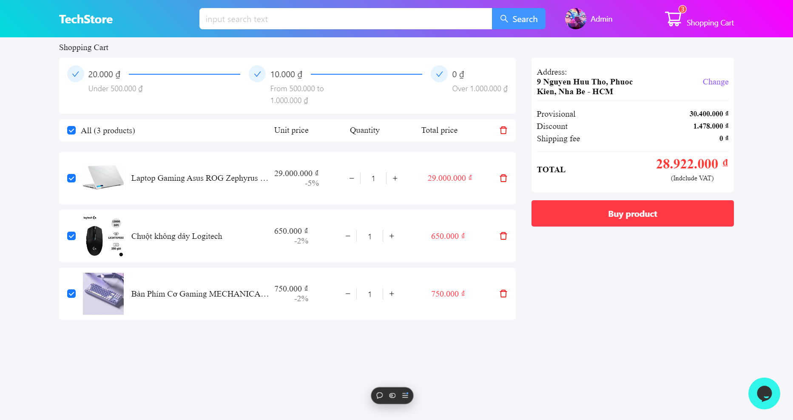

<h1 align="center" style="font-size: 58px">TechStore</h1>

<strong>E-commerce Website</strong>

# [Live Demo](https://tech-shop-blue.vercel.app/)

## Features

- User Authentication: JWT authentication with role-based access for Admin (email below) and Users.
- Product categories: Search for products, display by category navigation, view more products by pagination.
- Product details: View detailed information, select quantity, add to cart.
- User account: Register, log in, edit information, log out.
- Cart management: Select products, edit quantity, delete products, proceed to purchase.
- Order payment: Select delivery method, payment method, place order.
- Order management: View order details, cancel order.
- Customer care: Send consulting messages.
- Product management (Admin): Search, add, edit, delete products.
- Order management (Admin): Search, view details, export order reports.
- User management (Admin): Search, edit information, delete users.

## Main technology which I used

- [React](https://reactjs.org/): Used to build user interfaces for websites.
- [Redux Toolkit](https://redux-toolkit.js.org/): Manages the global state of the application, helping to process product, cart, user and order data efficiently.
- [Axios](https://axios-http.com/docs/intro): Used to make API requests between the frontend and backend, helping to retrieve and send data.
- [Ant Design](https://ant.design/): Provides modern interface components, helping to design professional, synchronous and user-friendly websites.
- [Node.js](https://nodejs.org/docs/latest/api/): Process requests from users and manage data efficiently.
- [Express.js](https://expressjs.com/): Builds a backend API to handle functions such as user authentication, product management, cart and orders.
- [MongoDB](https://www.mongodb.com/): Stores website data.
- [JSON Web Token](https://www.npmjs.com/package/jsonwebtoken): Authenticate and manage user access rights, ensuring security when logging in and using the system.

## Email admin for testing

- Email: phat01@gmail.com
- Password: 02122003

### Preview

